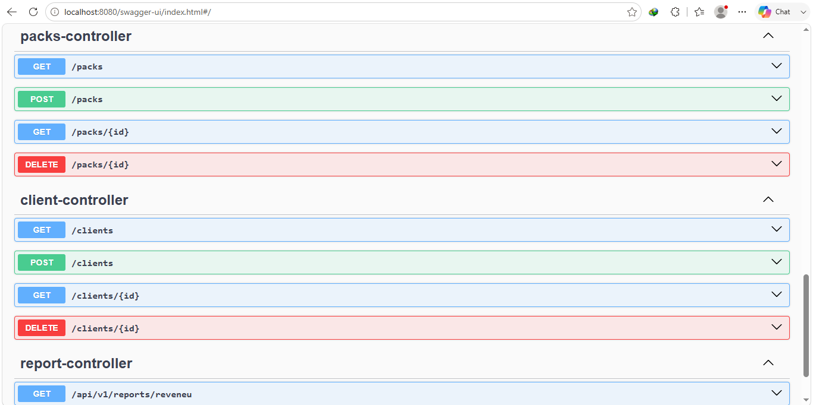
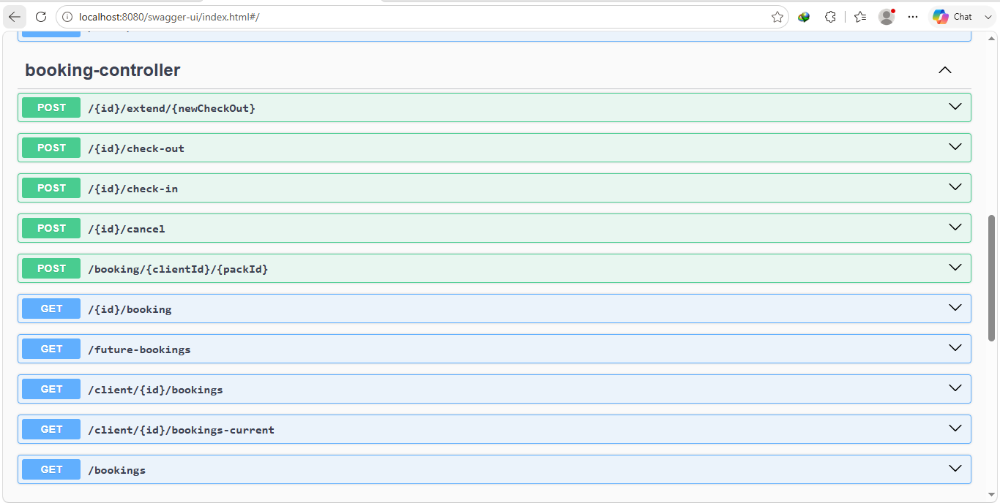
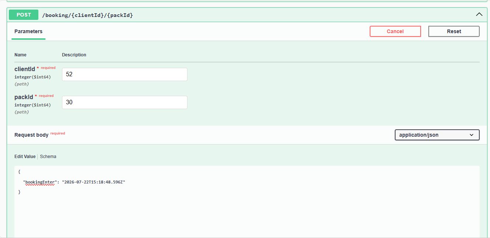
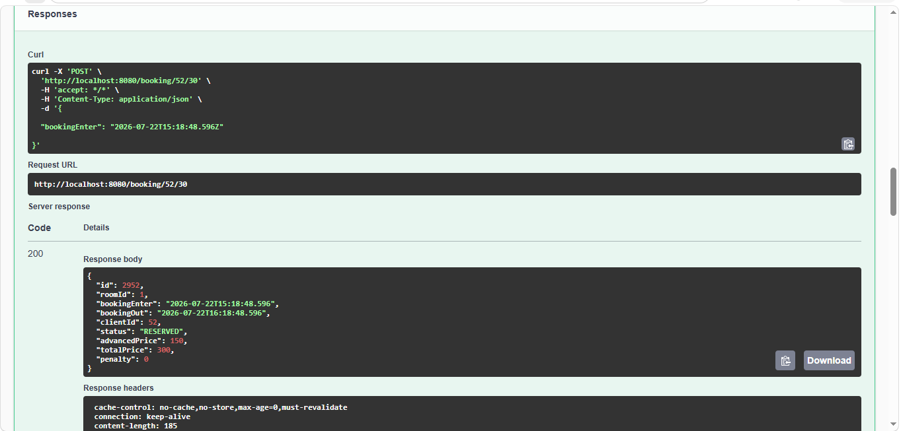
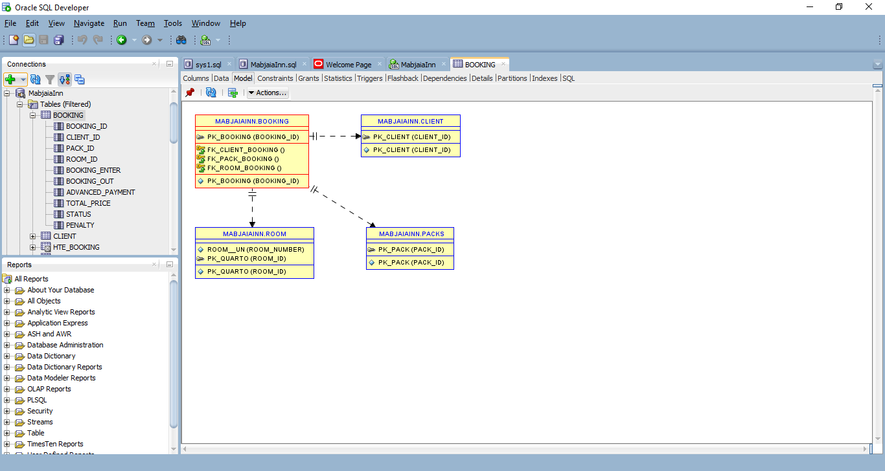

# 🏨 Guest House API


![Mockito]n(https://img.shields.io/badge/Mockito-Test-blue)


A RESTful API for managing a Guest House, built with **Java 26** and **Spring Boot**. This project provides a backend solution for managing guests, rooms, accommodation packages, and bookings while enforcing business rules for room availability, check-in, check-out, and cleaning periods.

## 🚀 Features

- 👤 Guest Management (CRUD)
- 🛏️ Room Management (CRUD)
- 📦 Package Management (CRUD)
- 📅 Booking Management
- ✅ Guest Check-in
- 🚪 Guest Check-out
- 🧹 Automatic Room Cleaning Workflow
- 🔍 Room Availability Validation
- 📌 Booking Status Management
- ⚠️ Global Exception Handling
- 📖 Interactive API Documentation with Swagger/OpenAPI
- 🧪 Unit Testing with JUnit 5 & Mockito
- 🌐 RESTful API Architecture

---

## 🛠️ Tech Stack

- Java 26
- Spring Boot
- Spring Data JPA
- Hibernate
- Oracle Database
- Maven
- Springdoc OpenAPI (Swagger UI)
- JUnit 5
- Mockito

---

## 📁 Project Structure

```text
src
├── controller
├── service
├── repository
├── model
├── dto
├── exception
├── config
└── resources
```

---

## ⚙️ Getting Started

### Prerequisites

- Java 26
- Maven
- Oracle Database

### Clone the Repository

```bash
git clone https://github.com/linnkjoe/guest-house-api.git
```

### Navigate to the Project

```bash
cd guest-house-api
```

### Configure the Database

Update the `application.properties` file:

```properties
spring.datasource.url=jdbc:oracle:thin:@localhost:1521:xe
spring.datasource.username=username
spring.datasource.password=password

spring.jpa.hibernate.ddl-auto=update
```

### Run the Application

```bash
mvn spring-boot:run
```

The API will be available at:

```
http://localhost:8080
```

---

## 📖 API Documentation

After starting the application, access the interactive Swagger UI:

```
http://localhost:8080/swagger-ui/index.html
```

Or access the OpenAPI specification:

```
http://localhost:8080/v3/api-docs
```

---

## 📌 Main Endpoints

| Resource | Endpoint |
|----------|----------|
| Guests | `/guests` |
| Rooms | `/rooms` |
| Packages | `/packages` |
| Bookings | `/bookings` |

---

## 📖 Booking Workflow

1. Create a booking.
2. The system validates room availability.
3. Perform guest check-in.
4. Perform guest check-out.
5. The room enters the cleaning state.
6. After the cleaning period, the room automatically becomes available again.

---

## 📸 API Documentation Preview

### Swagger UI Home



---

### Booking Endpoints



---

### Create Booking



---

### API Response Example



---

### Database Schema




## 🧪 Running Tests

Execute the test suite:

```bash
mvn test
```

The project includes **14 unit tests** covering the service layer using:

- **JUnit 5** for test execution.
- **Mockito** for dependency mocking and business logic isolation.

---

## 👨‍💻 Author

**Nélio Moanga**

Computer Science Student | Java Backend Developer

- GitHub: https://github.com/linnkjoe
- LinkedIn: https://www.linkedin.com/in/linnkjoe/

---


## 🚀 Future Improvements

- Authentication and Authorization with Spring Security & JWT
- Docker support
- CI/CD pipeline
- Integration tests
- Pagination and filtering
- Cloud deployment (AWS)

---

⭐ Feel free to contribute, open issues, or suggest improvements!
